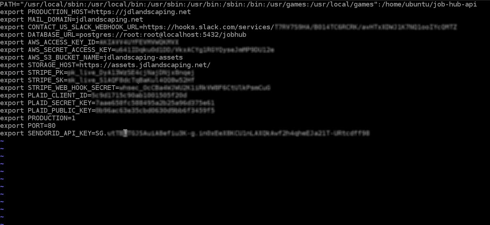

# Deployment Guide

## Prerequisites
* [AWS EC2 instance](https://console.aws.amazon.com/ec2/v2/home?region=us-east-1)
* [Node](https://nodejs.org/)
* [pm2](https://pm2.keymetrics.io/)
* [git](https://git-scm.com/)
* [npm](https://www.npmjs.com/)
* [postgresql](https://www.postgresql.org/)
* [aws cli](https://aws.amazon.com/cli/)

## Installation Steps
#### 1. Launch an Ubuntu 20.04 server EC2 instance.
#### 2. Install prerequisites.
```bash
sudo apt update
sudo apt install git
sudo apt install npm
sudo npm install -g n
sudo n 13.5.0
sudo npm install -g pm2
sudo apt install postgresql postgresql-contrib
sudo apt install awscli
```
#### 3. Configure postgresql
* create a user
```bash
sudo -i -u postgres
createuser --interactive
```
The script will prompt you with some choices and, based on your responses, execute the correct Postgres commands to create a user to your specifications.<br>
create user with username `root`.
* change postgresql connect option
Use vim or other text edit tool to edit `/etc/postgress/12/main/pg_hba.conf`.<br>
Find this part in the file and modify `peer` to `md5`.
```
local   all    all                                      peer
```
Should look like
```
local   all    all                                      md5
```
* restart postgres service
```
sudo service postgresql restart
```
* initialize db
```
sudo -u postgres psql
postgres=# create database jobhub;
postgres=# alter database jobhub owner to root;
postgres=# \c jobhub
postgres=# create extension "uuid-ossp";
```
#### 4. Configure git
You will have to save git credential for later use.
```
git config --global credential.helper 'store --file ~/.my-credentials'
```
#### 5. Clone repository
Clone `jobhub-api` repository to home directory(`/home/ubuntu/`).
```
git clone https://github.com/Jobhubgroup/job-hub-api.git job-hub-api
```
#### 6. Copy deploy script
```
mkdir /home/ubuntu/jobs
cp /home/ubuntu/job-hub-api/deployment/deploy.sh /home/ubuntu/jobs/
chmod +x /home/ubuntu/jobs/deploy.sh
```
#### 7. Add environment variables
Use vim or other text edit `/etc/environment` file.<br>
It will look like this after editing the file.<br>


#### 8. Configure pm2 environment
* build project for first use
```
cd /home/ubuntu/job-hub-api
git checkout prod
npm install
npm run build
```
* make pm2 entry
```
cd /home/ubuntu/job-hub-api
sudo pm2 start dist/main.js -n jdlandscaping-api
sudo pm2 startup
sudo pm2 save
```

The production server is up now and circleci will execute deploy script once there is any update in `prod` branch.

#### 9. Configure aws cli
```
aws configure
```

#### 10. Configure database backup script
Copy database backup script.
```
cp /home/ubuntu/job-hub-api/deployment/backupdb.sh /home/ubuntu/jobs/
chmod +x /home/ubuntu/jobs/backupdb.sh
sudo ln -s /home/ubuntu/jobs/backupdb.sh /usr/bin/backupdb
```

## Troubleshooting
#### 1. How to restart server instance?
```
sudo pm2 restart jdlandscaping-api
```

#### 2. How to add or update environment variables?
* Use text editor to update `/etc/environment`. 
* Restart server using following command.
```
sudo pm2 restart jdlandscaping-api --update-env
```

#### 3. How to make a database backup?
```
backupdb
```
This will upload a database dump file to aw3 s3 bucket.
